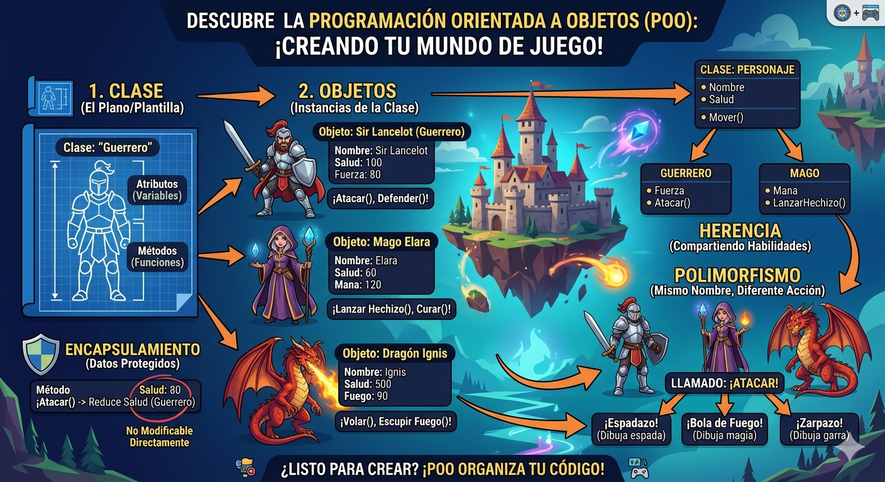

# poo en python
introducción a la programación orientada a objetos (POO) en python

## ¿por qué aprender POO?

- Imagina que quieres crear un video juego. Tienes guerros, magos, fragones... cada uno con sus propios puntos de vida, ataques y habilidades. ¿cómo los organizo en código sin repetir todo una y otra vez?

- La **Programación orientada a objetos (POO)** es la respuesta. En lugar de escribir instrucciones sueltas,modelas el mundo real con *objetos* que tienen caracteristicas y comportamientos. Es la forma en que estan construidos la mayoria de los programas profesionales del mundo.

("POO")

## Clase y objetos

- Una clase es un tipo de dato cuyas variables se llaman objetos o instancia.

- La clase es la definición del concepto del mundo real y losobjetos o instancias son el propio "objeto" del mundo real.

- Las clases estan compuestas por dos elementos:
     - **Atributos:** informacion que almacena la clase.
     - **Métodos:** operaciones que pueden realizarse con las clase.

## Definición de una clase en python

``` python
class NombreClase:

    def __init__(self, variable1, variable2):
        self.atributo1 = valor1
        self.atributo2 = valor2

    def nombreMetodo(self):
        BloqueCodigo
```

- `class`: palabra reservada en python para definir una clase.
- NombreClase`: nombre de la clase que se quiere crear.
- `def` : palabra reservada en python que se utiliza para definir tanto el constructor de la clase (método que se ejecuta la primera vez que usas clase) como los diferentes métodos que tiene.
- `__init__`: palabra reservada en python para definir el metodo constructor de la clase. El metodo `__init__` es lo primero que se ejecuta cuando creas un objeto de una clase.
- `(self, variablex)`: parametro del constructor de la clase. El parameto `self` es obligatorio y despues puedes tener tantos parametros como quieras. La forma de añadir parametros es la misma que en las funciones.
- `self.Atributox`: forma de utilizacion y acceso a los atributos de la clase.
- `nombreMetodo`: nombre del metodo de la clase.
- `self`: parametro del metodo. El parametro `self`es obligatorio y despues puedes tener  tantos parametros como quieras. La forma de añadir parametros es la misma que en las funciones.
- `BloqueCodigo`: instrucciones que ejecutara el metodo.

**Al definir una clase en cuenta:**
- Puedes definir tantos atributos como necesites.
- Puedes definir tantos metodos como necesites.
- Puedes definir tantos parametros en el constructor y en los metodos como necesites.